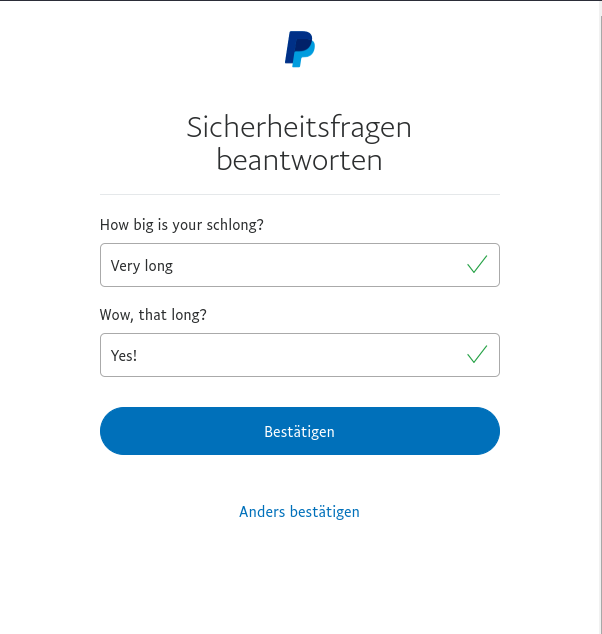
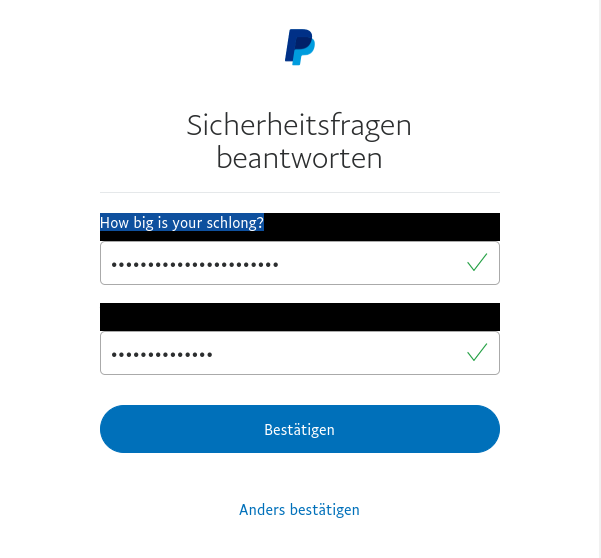

# PPPP
PayPal Peeping Protection - PPPP

## Protects you from Peeping Persons trying to read your KBA Questiond on PayPal

PayPal offers this feature that allows you to answer KBA like security questions if you cant use your phone for 2FA. This is great if your phone is out of battery of course, but whatever answer you write into the input fields is *NOT MASKED*. So anyone looking at your screen can read what you wrote. That sucks.

To combat this I made this bookmarklet. To go from this:

To this:

## Installation

Just drag the text from the link that says PPPP into your bookmark bar. To activate the PPPP click the Bookmark when you are at the Security question page at PayPal.

[PPPP](https://raw.githubusercontent.com/p410n3/PPPP/master/pppp.js)

## FAQ

Q: Why not as a UserScript for Tampermonkey, this way I dont have to press a button.
A: Two reasons: PayPal uses CSP, so it didn't work, and UserScript have an autoupdate feature, which means you have to trust me to not steal your PayPal credentials afetr an update.

Q: You should never use KBA in the first place!
A: But if you have to, it's a bit more secure now.
